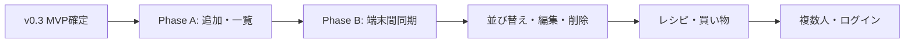

# 冷蔵庫管理アプリ — 要件定義書

| 項目 | 内容 |
|------|------|
| 版 | v0.3 |
| 最終更新 | 2026-05-24 |
| ステータス | MVP要件確定（実装着手可） |

---

## 1. プロジェクト概要

### 1.1 背景・目的

- **背景**: 冷蔵庫内の食材や期限の把握が難しく、廃棄や買い忘れが起きやすい。
- **目的**: 冷蔵庫の中身・期限・残量を記録し、買い物や調理の判断をしやすくする。

### 1.2 スコープ

| 対象 | 内容 |
|------|------|
| **含む（In）** | 食材の登録・一覧、賞味期限・消費期限・残量の記録、（将来）レシピ、買い物リスト、端末間でのデータ参照 |
| **含まない（Out）** | 初版でのログイン、SNS連携、課金、店舗価格比較、バーコード自動読取（将来検討可） |

### 1.3 想定ユーザー

| 項目 | 内容 |
|------|------|
| **主な利用者** | 現時点は本人のみ。将来は家族など複数人利用の可能性あり。 |
| **利用シーン** | 買い物後・料理前にスマホで確認、自宅PCで一覧を見る。 |
| **ITリテラシー** | 一般的なスマホアプリ操作ができれば利用可能な水準を想定。 |

---

## 2. 記録の対象

### 2.1 ドメイン一覧

| ドメイン | 内容 | 初版（Must） |
|----------|------|----------------|
| **食材（冷蔵庫の中身）** | 名称、残量、賞味期限・消費期限など | **対象** |
| **レシピ** | 料理名、材料、手順など | 将来（Should 以降） |
| **買うもの** | 買い物リスト | 将来（Should 以降） |

**初版の対象**: **食材のみ**（Q7 確定）

### 2.2 食材1件に含める情報

| 項目 | 初版 | 説明 |
|------|------|------|
| 食材名 | 必須 | 例：牛乳、にんじん |
| 残量 | 推奨 | 数値 + **単位（選択式）**（例：500 ml、2 個） |
| 賞味期限 | 任意 | 品質保持期限 |
| 消費期限 | 任意 | 安全上の期限（ある場合） |
| 保管場所 | 任意 | 冷蔵 / 冷凍 / 野菜室 など |
| メモ | 任意 | 開封日、ブランドなど |

---

## 3. 機能要件

優先度: **Must** = 初版必須 / **Should** = 次に早い / **Could** = 将来

### 3.1 食材（冷蔵庫）

| ID | 機能 | 優先度 | 説明 |
|----|------|--------|------|
| F-01 | 食材の追加 | **Must** | 新しい食材を1件登録する |
| F-02 | 食材の一覧 | **Must** | 登録済み食材をシンプルなリストで見る（**デフォルトは名前順**） |
| F-02a | 一覧の並び順変更 | Should | 名前順 / 期限順 / 登録日順などを切り替え（初版後） |
| F-03 | 食材の編集 | Should | 残量・期限の更新 |
| F-04 | 食材の削除 | Should | 消費済み・廃棄時の削除 |
| F-05 | 期限が近い順の表示 | Should | 期限切れ・間近を分かりやすく |
| F-06 | 検索・フィルタ | Could | 名前・保管場所で絞り込み |

### 3.2 レシピ

| ID | 機能 | 優先度 | 説明 |
|----|------|--------|------|
| F-10 | レシピの追加・一覧 | Should | 料理と材料の記録 |
| F-11 | 在庫とレシピの突合 | Could | 作れる料理の提案 |

### 3.3 買い物

| ID | 機能 | 優先度 | 説明 |
|----|------|--------|------|
| F-20 | 買うものの追加・一覧 | Should | 買い物リスト |
| F-21 | 購入済みにする | Should | リストから消す・食材に反映 |

### 3.4 共通・将来

| ID | 機能 | 優先度 | 説明 |
|----|------|--------|------|
| F-30 | 複数人での共有 | Could | 家族アカウント・共同編集 |
| F-31 | ログイン | Could | 現段階は不要。将来の複数人利用時に検討 |
| F-32 | 期限通知 | Could | プッシュやメール |

---

## 4. 非機能要件

| ID | 区分 | 要件 | 目標 |
|----|------|------|------|
| NF-01 | 利用環境 | PC・スマホのブラウザ | スマホ優先、レスポンシブ |
| NF-02 | UI | 見た目 | **シンプルな一覧**（カレンダー中心ではない） |
| NF-03 | 認証 | ログイン | **初版は不要** |
| NF-04 | データ同期 | 別端末から同じデータを見たい | **Phase B で実装**（初版は単一端末・ブラウザ内保存） |
| NF-05 | 言語 | UI | 日本語 |
| NF-06 | 性能 | 一覧 | 家庭利用の件数（おおむね数百件）で快適 |
| NF-07 | 拡張性 | 複数人利用 | 将来に備え、データ構造・同期方式を拡張可能に |

### 4.1 端末間同期について（重要）

ログインなしで「スマホとPCで同じデータ」を実現するには、**クラウド上の共有ストア**が必要です。

| フェーズ | 内容 | 備考 |
|----------|------|------|
| **Phase A（初版 Must）** | 食材の追加・一覧 | まず動くものを作る |
| **Phase B（次フェーズ）** | クラウド同期 | ログインなし案：共有コード・URL等（Q10 で方式選定） |
| **Phase C（将来）** | ログイン・複数人 | 家族共有時 |

**合意（Q9）**: 別端末同期は初版の次フェーズで問題なし。Phase A は端末内保存のみ。

---

## 5. 制約・前提

| 項目 | 内容 |
|------|------|
| 予算 | 無料枠を中心（ホスティング・DB） |
| 技術 | Webアプリ（ブラウザで利用） |
| 個人情報 | 食材名・メモに個人名等を入れない運用を推奨 |

---

## 6. 成功基準（初版）

- [ ] 食材を追加できる（名称は必須）
- [ ] 登録した食材を一覧で見られる（シンプルなリスト）
- [ ] スマホ・PCのブラウザで表示が崩れない
- [ ] 同一端末で再訪問してもデータが残る
- [ ] （Phase B 実施時）別端末から同じデータを参照できる

**初版では含めない（合意済み）**: 編集・削除、レシピ、買い物リスト、ログイン

---

## 7. 確定した回答（Q1〜Q6）

| # | 質問 | 回答 |
|---|------|------|
| Q1 | 何を記録するか？ | 冷蔵庫の中身。食材の賞味期限・消費期限、残量、（将来）レシピ・買うもの |
| Q2 | 利用者は？ | 現在は自分のみ。将来は複数人の可能性 |
| Q3 | ログインは？ | 現段階は不要 |
| Q4 | 別端末から見たいか？ | はい |
| Q5 | 初版の必須機能は？ | **追加と一覧のみ** |
| Q6 | 見た目は？ | シンプル |

---

## 8. 確定した回答（Q7〜Q11）

| # | 質問 | 回答 |
|---|------|------|
| Q7 | 初版は食材のみか？ | **はい**（レシピ・買い物は含めない） |
| Q8 | 一覧の並び順は？ | **デフォルトは名前順**。今後、並び順を変更できるようにする（Should） |
| Q9 | 別端末同期は？ | **次のフェーズで問題なし** |
| Q10 | ログインなしの同期方式 | **未決**（Phase B 着手前に選定） |
| Q11 | 残量の単位は？ | **選択形式**（プリセットから選ぶ） |

---

## 9. 残りの未決事項

| # | 質問 | いつ決めるか |
|---|------|--------------|
| Q10 | 共有コード / 共有URL など同期方式 | Phase B 設計時 |

---

## 10. リリース計画

| フェーズ | 主な機能 |
|----------|----------|
| **Phase A（今）** | 食材の追加・一覧、名前順、単位選択、IndexedDB |
| **Phase B** | クラウド同期（別端末） |
| **Phase C** | 並び順切替、編集・削除、期限バッジ |
| **Phase D** | レシピ、買い物リスト |
| **Phase E** | 複数人・ログイン |

---

## 11. 変更履歴

| 版 | 日付 | 変更内容 |
|----|------|----------|
| v0.1 | 2026-05-24 | ドラフト作成 |
| v0.2 | 2026-05-24 | ヒアリング回答を反映（冷蔵庫・食材中心） |
| v0.3 | 2026-05-24 | Q7〜Q9・Q11 確定。MVP実装着手可 |
