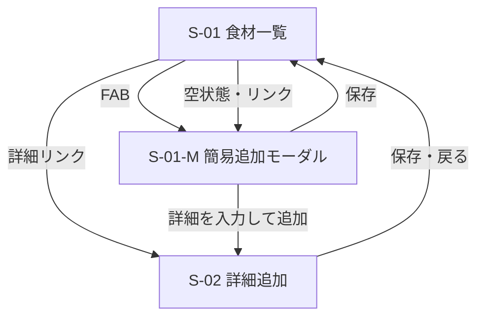

# 冷蔵庫管理アプリ — 仕様書

| 項目 | 内容 |
|------|------|
| 版 | v0.5 |
| 最終更新 | 2026-05-24 |
| 参照 | [要件定義書](./requirements.md) |
| ステータス | Phase B（期限必須化）仕様を追記 |

---

## 1. システム構成

### 1.1 全体像

```
[スマホ / PC ブラウザ]
        ↓
[Webアプリ（フロントエンド）]
        ↓
[データ層]
  ├─ Phase A: ブラウザ内（IndexedDB 等）※単一端末
  └─ Phase B: クラウドDB（Supabase 等）※端末間同期・ログインなし方式
```

### 1.2 技術選定（案・未確定）

| レイヤ | 初版（Phase A）案 | Phase B 案 |
|--------|-------------------|------------|
| フロント | HTML + CSS + JavaScript、または Vite + React | 同左 |
| 保存 | IndexedDB | Supabase（無料枠）等 |
| 同期 | なし | 世帯ID + 共有コード（ログインなし）など |
| 公開 | ローカル確認 → Vercel / Netlify | 同左 |

---

## 2. MVP スコープ（初版）

| 項目 | 内容 |
|------|------|
| 対象データ | **食材（FoodItem）のみ** |
| 画面 | 一覧（S-01）、簡易追加モーダル（S-01-M）、詳細追加（S-02） |
| 一覧の並び | **食材名のあいうえお順（昇順）** |
| FAB の動作 | **モーダルを開く**（`add.html` へは遷移しない） |
| 単位入力 | 詳細追加のみ・**セレクトボックス**（プリセット） |
| 保存 | **IndexedDB**（単一端末） |
| 実装状況 | S-01 済 / S-01-M・S-02 は未実装（FAB は暫定で `add.html` リンク） |
| 含まない | 並び替えUI、編集・削除、同期、レシピ、買い物、ログイン |

---

## 3. 画面一覧

| ID | 画面名 | 初版 | 概要 |
|----|--------|------|------|
| S-01 | 食材一覧 | **Must** | リスト表示。右下 FAB で簡易追加モーダル |
| S-01-M | 簡易追加モーダル | **Must** | 一覧上に重ねて表示。最小項目で保存 |
| S-02 | 食材詳細追加 | **Must** | 全項目の登録フォーム（別画面） |
| S-03 | 食材詳細・編集 | 将来 | タップで詳細、編集・削除 |
| S-10 | レシピ一覧・追加 | 将来 | |
| S-20 | 買い物リスト | 将来 | |
| S-90 | 設定・同期 | Phase B | 共有コードの表示・入力 |

### 3.1 S-01 食材一覧（ワイヤ）

```
+--------------------------------------+
|            食材一覧                  |
+--------------------------------------+
|  牛乳                                |
|  残り 800ml · 賞味 5/28              |
|--------------------------------------|
|  にんじん                            |
|  残り 3本 · 消費 5/30                |
|--------------------------------------|
|  （空のとき）                        |
|  食材がまだありません                |
|  [ 簡易追加 ]  [ 詳細を入力して追加 ]|
+--------------------------------------+
|                              ( FAB ) |
+--------------------------------------+
```

- ヘッダー：**食材一覧**（中央）
- FAB：右下固定の丸い **＋アイコン** → **S-01-M を開く**（ページ遷移なし）
- 並び順：**食材名の昇順（日本語ロケール `ja`）**
- 並び替えUI：初版ではなし（Phase C）
- 期限表示：日付テキストのみ（バッジは Phase C）

### 3.2 S-01-M 簡易追加モーダル（ワイヤ）

```
+--------------------------------------+
|  ■■■■■ 半透明オーバーレイ ■■■■■  |
|  +--------------------------------+  |
|  |  食材を追加（かんたん）    [×] |  |
|  |  食材名 *  [______________]   |  |
|  |  期限の種類 ( )賞味 ( )消費    |  |
|  |  期限      [____/____/____]    |  |
|  |  [ 保存 ]  [ 詳細を入力して追加 ]|
|  +--------------------------------+  |
+--------------------------------------+
```

| 項目 | Phase A | Phase B | 備考 |
|------|---------|---------|------|
| 食材名 | 必須 | 必須 | |
| 期限の種類 | 任意 | 必須（日付入力時） | `bestBefore` / `useBy` のどちらに保存するか |
| 期限日 | 任意 | **必須** | 賞味または消費のいずれか一方 |

**操作**

| 操作 | 挙動 |
|------|------|
| 保存 | バリデーション → IndexedDB 保存 → モーダルを閉じる → 一覧を再描画 |
| × / オーバーレイタップ | 未保存なら確認後に閉じる（任意） |
| 詳細を入力して追加 | モーダルを閉じ **S-02** へ遷移（入力中の食材名は引き継ぎ可） |

**アクセシビリティ**

- モーダルに `role="dialog"`、`aria-modal="true"`
- 開いたときフォーカスを食材名入力へ
- `Esc` で閉じる

### 3.3 S-02 食材詳細追加（ワイヤ）

```
+--------------------------------------+
|  ← 戻る      食材を追加（詳細）      |
+--------------------------------------+
|  食材名 *     [________________]     |
|  残量         [____] [単位 ▼]        |
|  賞味期限     [____/____/____]  ※排他 |
|  消費期限     [____/____/____]  ※排他 |
|  （Phase B: いずれか一方必須）       |
|  保管場所     [冷蔵 ▼]               |
|  メモ         [________________]     |
+--------------------------------------+
|              [ 保存 ]                |
+--------------------------------------+
```

- **FAB からは開かない**。モーダルのリンク、空状態、設定メニュー等から遷移
- 賞味・消費期限は **排他入力**（一方入力時は他方をグレーアウト）
- **Phase B**: 賞味・消費の **いずれか一方の入力を必須**
- 保存後は **S-01** に戻る

### 3.4 画面遷移



---

## 4. データモデル

### 4.1 FoodItem（食材）

| フィールド | 型 | 必須 | 説明 |
|------------|-----|------|------|
| id | string (UUID) | ○ | 一意ID |
| name | string | ○ | 食材名 |
| quantity | number | - | 残量の数値 |
| unit | string (enum) | - | 単位（下記プリセットから選択） |
| bestBefore | date (YYYY-MM-DD) | - ※ | 賞味期限 |
| useBy | date (YYYY-MM-DD) | - ※ | 消費期限 |

※ **Phase B（次フェーズ）**: 新規登録時は `bestBefore` と `useBy` の **少なくとも一方** が必須。両方同時は不可（排他）。現行 Phase A ではいずれも任意。
| storage | enum | - | `fridge` / `freezer` / `vegetable` / `other` |
| memo | string | - | 自由メモ |
| createdAt | datetime (ISO8601) | ○ | 登録日時 |

### 4.2 例（JSON）

```json
{
  "id": "a1b2c3d4-e5f6-7890-abcd-ef1234567890",
  "name": "牛乳",
  "quantity": 800,
  "unit": "ml",
  "bestBefore": "2026-05-28",
  "useBy": null,
  "storage": "fridge",
  "memo": "低脂肪",
  "createdAt": "2026-05-24T10:30:00+09:00"
}
```

### 4.3 単位プリセット（Q11 確定）

追加画面の `<select>` 用。初版は固定リスト。

| value | 表示ラベル |
|-------|------------|
| `ml` | ml |
| `l` | L |
| `g` | g |
| `kg` | kg |
| `piece` | 個 |
| `stick` | 本 |
| `pack` | パック |
| `bag` | 袋 |
| （空） | —（単位なし） |

- 残量の数値未入力時は、単位も保存しない（または null）
- 将来「その他」が必要なら Phase C 以降で検討

### 4.4 保管場所プリセット

| value | 表示ラベル |
|-------|------------|
| `fridge` | 冷蔵 |
| `freezer` | 冷凍 |
| `vegetable` | 野菜室 |
| `other` | その他 |

### 4.5 将来エンティティ（参考）

**Recipe（レシピ）**: title, ingredients[], steps, memo  
**ShoppingItem（買うもの）**: name, quantity, unit, checked, linkedFoodItemId?

---

## 5. 操作フロー

### 5.1 簡易追加（モーダル）

1. S-01 で FAB をタップ
2. S-01-M を表示（背景スクロールは固定推奨）
3. 食材名（必須）と任意の期限を入力
4. 「保存」→ IndexedDB に `FoodItem` を保存（未入力項目は `null`）
5. モーダルを閉じ、一覧を再描画

### 5.2 詳細追加（画面）

1. S-01 または S-01-M から S-02 へ遷移
2. 全項目を入力（食材名は必須）
3. 「保存」→ IndexedDB に保存
4. S-01 に戻り、一覧を更新

### 5.3 一覧の表示

1. 起動時に IndexedDB から全 FoodItem を取得
2. **名前順にソート**: `name` を `localeCompare(name, 'ja')` で昇順
3. 同一名称は `createdAt` の新しい順（副次ソート）
4. 0件なら空状態メッセージ

### 5.4 並び順変更（Phase C・将来）

| キー | ラベル | ソートロジック |
|------|--------|----------------|
| `name` | 名前順 | 現在のデフォルト |
| `expiry` | 期限が近い順 | `min(bestBefore, useBy)` の昇順、未設定は末尾 |
| `created` | 登録日順 | `createdAt` 降順 |

- ユーザー選択は `localStorage` の `sortOrder` に保存（実装時）

---

## 6. バリデーション

### 6.1 簡易追加（モーダル）— Phase A（現行）

| 対象 | ルール | エラーメッセージ |
|------|--------|------------------|
| name | 1文字以上、最大100文字程度 | 食材名を入力してください |
| 期限日 | 未入力可。入力時は有効な日付 | 日付の形式が正しくありません |

### 6.2 簡易追加（モーダル）— Phase B（次フェーズ）

| 対象 | ルール | エラーメッセージ |
|------|--------|------------------|
| name | 1文字以上、最大100文字程度 | 食材名を入力してください |
| 期限日 | **必須**。有効な日付。種類（賞味/消費）を選択 | 賞味期限または消費期限を入力してください |
| 期限日 | 形式チェック | 日付の形式が正しくありません |

### 6.3 詳細追加（画面）— Phase A（現行）

| 対象 | ルール | エラーメッセージ |
|------|--------|------------------|
| name | 1文字以上、最大100文字程度 | 食材名を入力してください |
| quantity | 未入力可。入力時は 0 より大 | 残量は0より大きい数値にしてください |
| bestBefore / useBy | 未入力可。**同時入力不可**（排他UI） | 日付の形式が正しくありません |

### 6.4 詳細追加（画面）— Phase B（次フェーズ）

| 対象 | ルール | エラーメッセージ |
|------|--------|------------------|
| name | 1文字以上、最大100文字程度 | 食材名を入力してください |
| bestBefore / useBy | **少なくとも一方必須**。同時入力不可 | 賞味期限または消費期限を入力してください |
| bestBefore / useBy | 入力時は有効な日付 | 日付の形式が正しくありません |
| quantity | 未入力可。入力時は 0 より大 | 残量は0より大きい数値にしてください |

**Phase B 共通の検証ロジック（案）**

```javascript
function hasRequiredExpiry(bestBefore, useBy) {
  return Boolean(bestBefore || useBy);
}
```

保存前に `hasRequiredExpiry` が `false` の場合は保存を拒否する。

---

## 7. 表示ルール（一覧）

| 条件 | 表示（案） |
|------|------------|
| 賞味・消費どちらもなし | 名称 + 残量のみ |
| 期限あり | `賞味 5/28` / `消費 5/30` |
| 今日より前 | `期限切れ` バッジ（Should） |
| 3日以内 | `間近` バッジ（Should） |

---

## 8. Phase B（次フェーズ）まとめ

| 区分 | 内容 |
|------|------|
| 同期 | 端末間でデータ共有（Q10 で方式選定） |
| 登録バリデーション | 新規登録時、賞味 **または** 消費期限を必須 |
| UI | 簡易追加・詳細追加の両方に適用 |
| 排他入力 | 詳細追加の賞味/消費排他は維持 |

---

## 9. 端末間同期（Phase B 仕様メモ）

ログインなしで同期する場合の案（Q10 で選定）:

| 方式 | 概要 | メリット | 注意 |
|------|------|----------|------|
| 共有コード | 8桁コードで同じ「世帯」に参加 | 実装が比較的簡単 | コード漏洩に注意 |
| 共有URL | URLを開くと同じデータ | 導入が簡単 | URL管理が必要 |

- **Phase A では未実装**（Q9：次フェーズで対応）
- Phase B で Supabase 等に `householdId` + `items` テーブルを想定
- 方式は Q10 で選定（共有コード / 共有URL）

---

## 10. エラー・例外

| 状況 | 挙動 |
|------|------|
| 保存失敗 | 「保存できませんでした」+ 入力保持 |
| 読み込み失敗 | 空状態 + 再読み込み案内 |
| オフライン（Phase B） | キャッシュ表示 + 同期は復帰後（将来） |

---

## 11. 未決事項

| ID | 内容 | タイミング |
|----|------|------------|
| Q10 | 同期方式（共有コード / URL） | Phase B 設計時 |
| Q13 | 期限なしの既存食材を編集するとき期限を必須にするか | Phase B 設計時 |

---

## 12. 変更履歴

| 版 | 日付 | 変更内容 |
|----|------|----------|
| v0.1 | 2026-05-24 | 骨組み作成 |
| v0.2 | 2026-05-24 | 冷蔵庫・食材MVPに具体化。レシピ・買い物は将来 |
| v0.3 | 2026-05-24 | Q7〜Q9・Q11 反映。名前順・単位選択・Phase B 同期 |
| v0.4 | 2026-05-24 | FAB→簡易モーダル、詳細追加画面の2系統を定義 |
| v0.5 | 2026-05-24 | Phase B：登録時の期限（賞味 or 消費）必須化を追記 |
